Windows 2012 R2 - ADFS 3.0
==========================

Getting this module to work is sometimes not so straight forward. If your not familiar with JWT tokens or ADFS itself,
it might take some tries to get all settings right.

This guide tries to give a basic overview of how to configure ADFS and how to determine the settings for
django-auth-adfs. Installing and configuring the basics of ADFS is not explained here.

* **ADFS server:** https://adfs.example.com
* **Web server:** http://web.example.com:8000

Step 1 - Configuring a Relying Party Trust
------------------------------------------

From the AD FS Management screen, go to **AD FS ➜ Trust Relationships ➜ Relying Party Trusts** and
click **Add Relying Party Trust...**

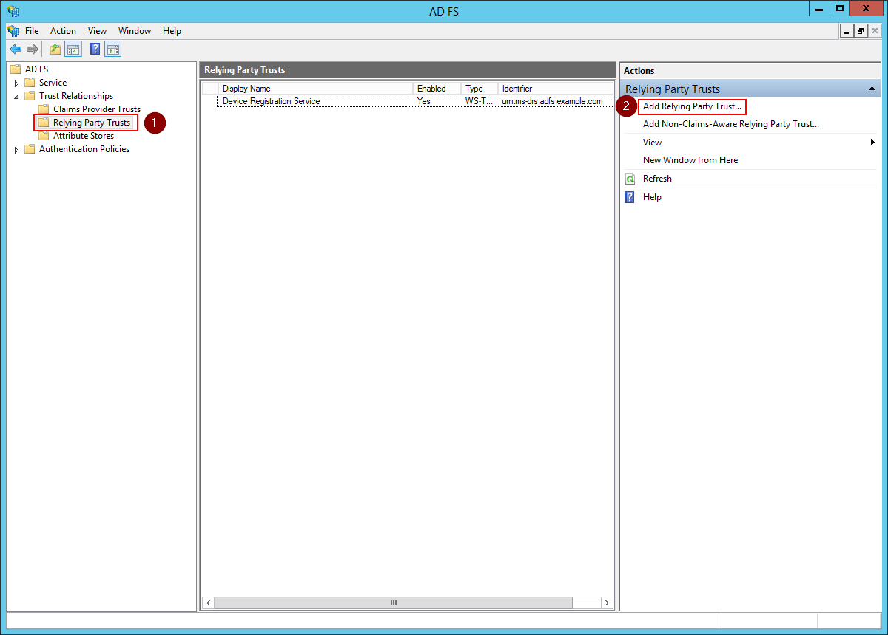

------------

Click **Start**

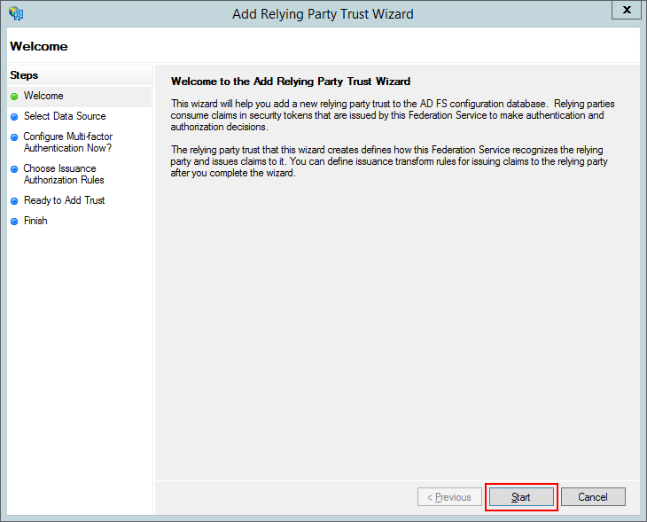

------------

Select **Enter data about the relying party manually** and click **Next**

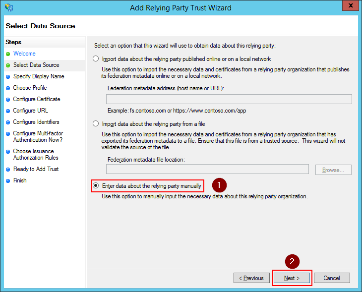

------------

Enter a display name for the relying party and click **Next**.

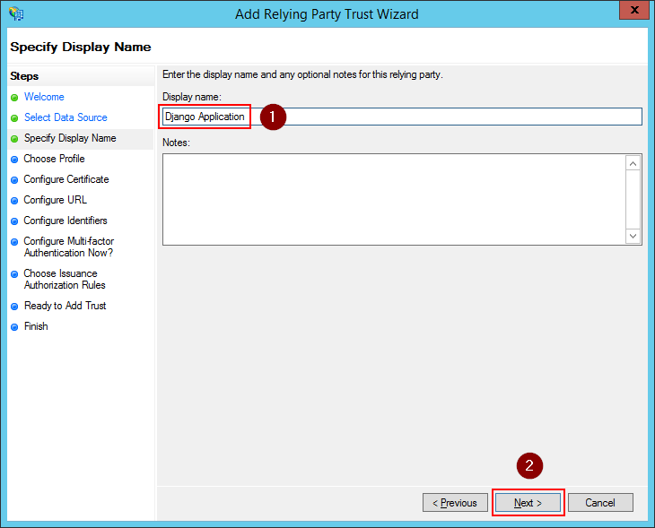

------------

Select **AD FS profile** and click **Next**

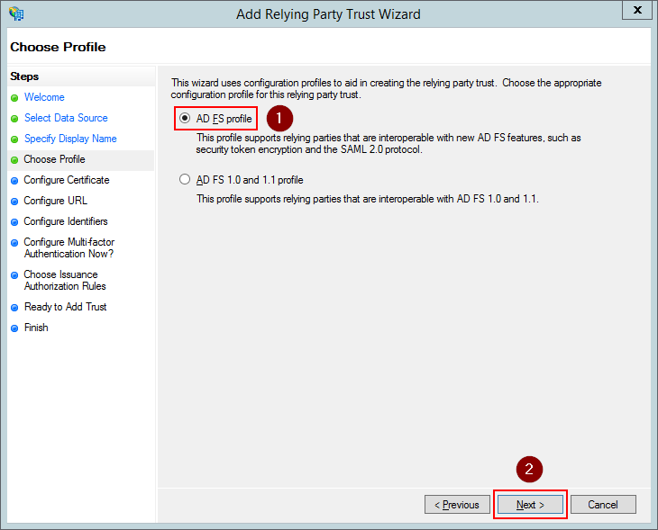

------------

Leave everything empty click **Next**

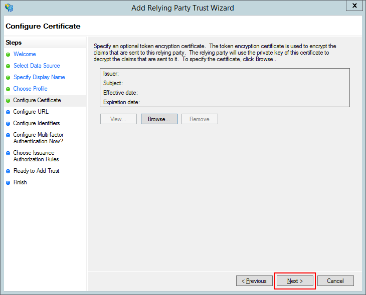

------------

We don't need WS-Federation or SAML support so leave everything empty and click **Next**

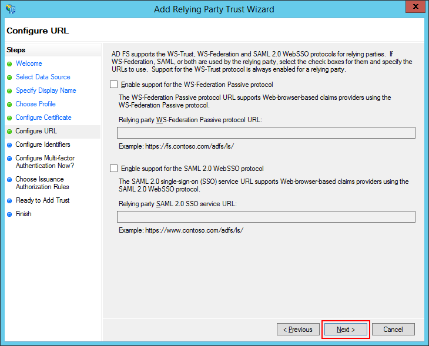

------------

Enter a relying party trust identifier and click **add**. The identifier can be anything but beware, there's a
difference between entering a URL and something else. For more details see the example section of
:ref:`the AUDIENCE setting <audience_setting>`.

.. note::
    This is the value for the :ref:`audience_setting` and the :ref:`relying_party_id_setting` settings.

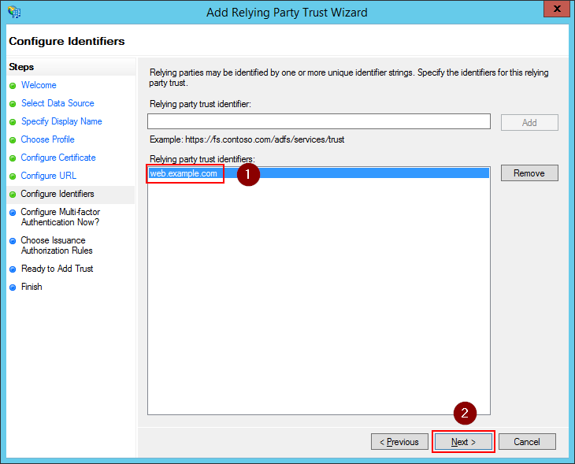

------------

Select **I do not want to configure...** and click **Next**.

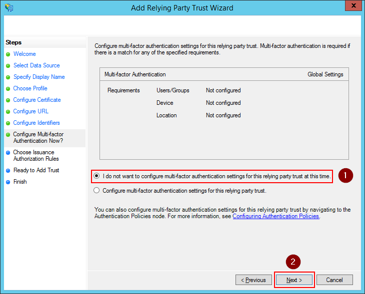

------------

Select **Permit all users to access the relying party** and click **Next**.

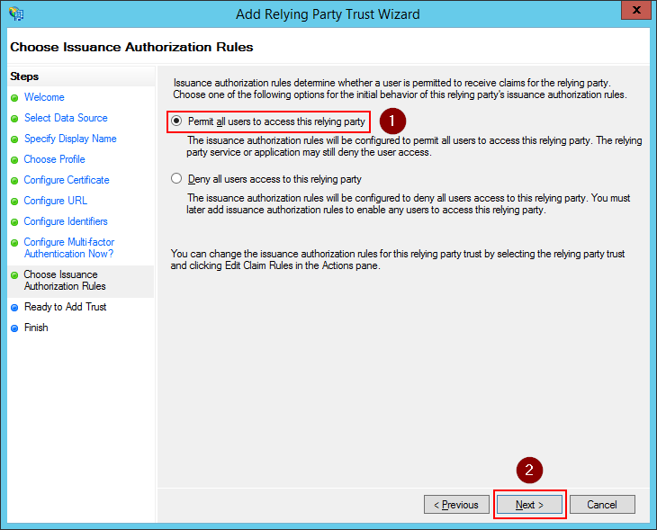

------------

Review the settings and click **Next** to create the relying party.

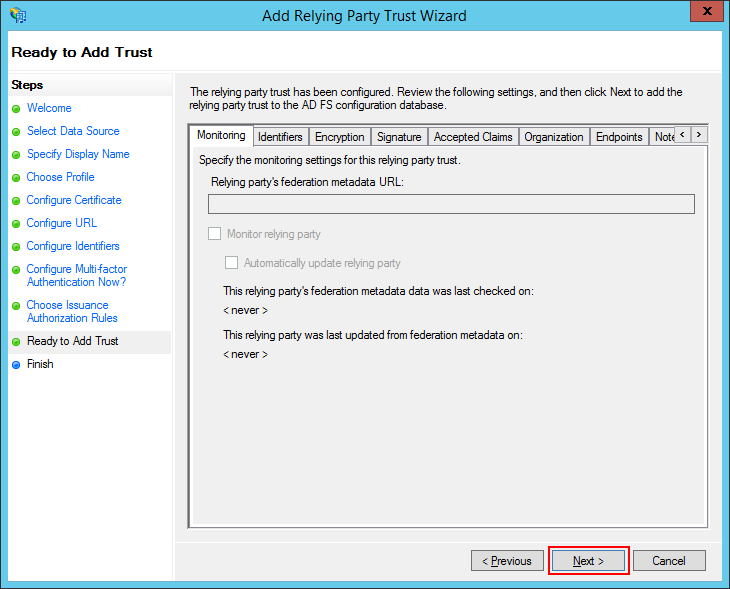

------------

Check **Open the Edit Claim Rules dialog...** and click **Close**

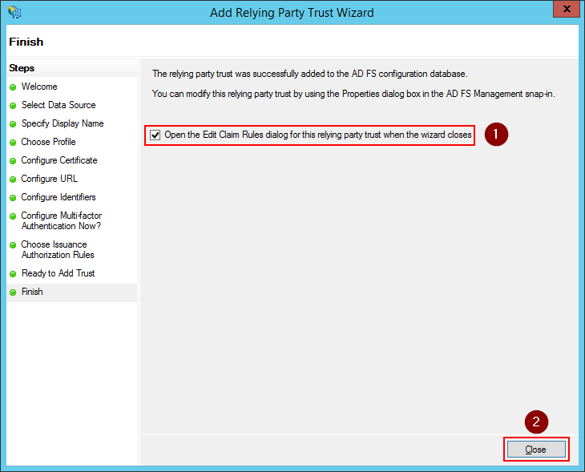


Step 2 - Configuring Claims
---------------------------

If you selected **Open the Edit Claim Rules dialog...** while adding a relying party, this screen will open
automatically. Else you can open it by right clicking the relying party in the list and select **Edit Claim Rules...**

On the **Issuance Transform Rules** tab, click the **Add Rule** button

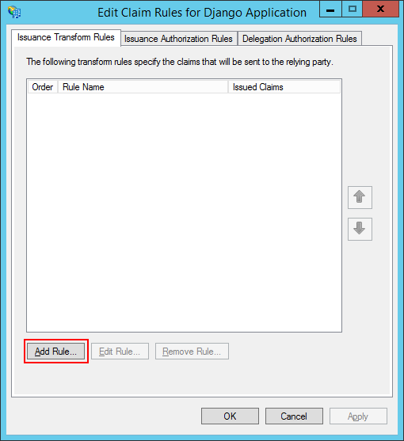

------------

Select **Send LDAP Attributes as Claims** and click **Next**

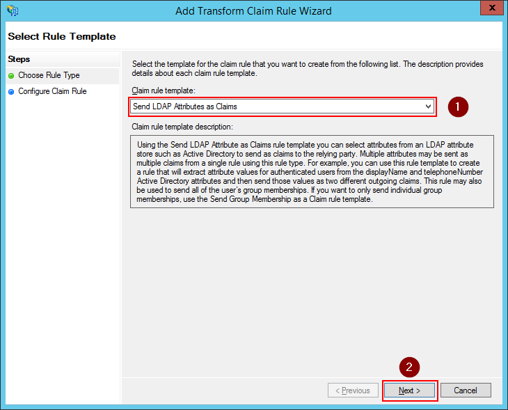

------------

Give the rule a name and select **Active Directory** as the attribute store. Then configure the below claims.

+----------------------------------+----------------------+
| LDAP Attribute                   | Outgoing Claim Type  |
+==================================+======================+
| E-Mail-Addresses                 | E-Mail Address       |
+----------------------------------+----------------------+
| Given-Name                       | Given Name           |
+----------------------------------+----------------------+
| Surname                          | Surname              |
+----------------------------------+----------------------+
| Token-Groups - Unqualified Names | Group                |
+----------------------------------+----------------------+
| SAM-Account-Name                 | Windows Account Name |
+----------------------------------+----------------------+

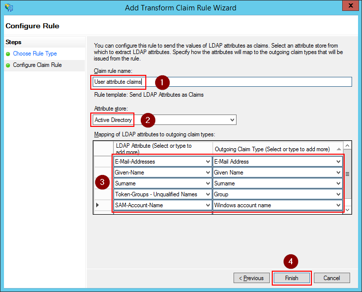

Click **OK** to save the settings

.. note::
    The **Outgoing Claim Type** is what will be visible in the JWT Access Token. The first 3 claims will go into the
    :ref:`claim_mapping_setting` setting. The 4th is the :ref:`groups_claim_setting` setting. The 5th is the
    :ref:`username_claim_setting` setting.

    You cannot just copy the outgoing claim type value from this screen and use it in the settings. The name of the
    claim as it is in the JWT token is the short name which you can find in the AD FS Management screen underneath
    **AD FS ➜ Service ➜ Claim Descriptions**

------------

You should now see the rule added. Click **OK** to save the settings.

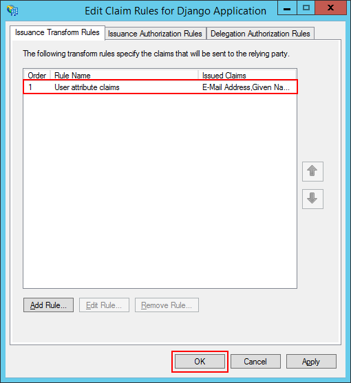

Step 3 - Add an ADFS client
---------------------------

While the previous steps could be done via the GUI, the next step must be performed via PowerShell.

Pick a value for the following fields.

+-------------+----------------------------------------------+
| Name        | Example value                                |
+=============+==============================================+
| Name        | Django Application OAuth2 Client             |
+-------------+----------------------------------------------+
| ClientId    | 487d8ff7-80a8-4f62-b926-c2852ab06e94         |
+-------------+----------------------------------------------+
| RedirectUri | http://web.example.com/oauth2/callback       |
+-------------+----------------------------------------------+

Now execute the following command from a powershell console.

.. code-block:: ps1con

    PS C:\Users\Administrator> Add-ADFSClient -Name "Django Application OAuth2 Client" `
                                              -ClientId "487d8ff7-80a8-4f62-b926-c2852ab06e94" `
                                              -RedirectUri "http://web.example.com/oauth2/callback"

The **ClientId** value will be the :ref:`client_id_setting` setting and the **RedirectUri** value is based on where you
added the ```django_auth_adfs`` in your ``urls.py`` file.

Step 4 - Determine configuration settings
-----------------------------------------

Once everything is configured, you can use the below PowerShell commands to determine the value for the settings of this
package. The ``<<<<<<`` in the output indicate which settings should match this value.

.. code-block:: ps1con

    PS C:\Users\Administrator> Get-AdfsClient -Name "Django Application OAuth2 Client"

    RedirectUri : {http://web.example.com:8000/oauth2/callback}
    Name        : Django Application OAuth2 Client
    Description :
    ClientId    : 487d8ff7-80a8-4f62-b926-c2852ab06e94      <<< CLIENT_ID <<<
    BuiltIn     : False
    Enabled     : True
    ClientType  : Public

    PS C:\Users\Administrator> Get-AdfsProperties | select HostName | Format-List

    HostName : adfs.example.com      <<< SERVER <<<

    PS C:\Users\Administrator> Get-AdfsRelyingPartyTrust -Name "Django Application" | Select Identifier | Format-List

    Identifier : {web.example.com}      <<< RELYING_PARTY_ID and AUDIENCE <<<

If you followed this guide, you should end up with a configuration like this.

.. code-block:: python

    AUTH_ADFS = {
        "SERVER": "adfs.example.com",
        "CLIENT_ID": "487d8ff7-80a8-4f62-b926-c2852ab06e94 ",
        "RELYING_PARTY_ID": "web.example.com",
        "AUDIENCE": "microsoft:identityserver:web.example.com",
        "CLAIM_MAPPING": {"first_name": "given_name",
                          "last_name": "family_name",
                          "email": "email"},
        "USERNAME_CLAIM": "winaccountname",
        "GROUP_CLAIM": "group"
    }
