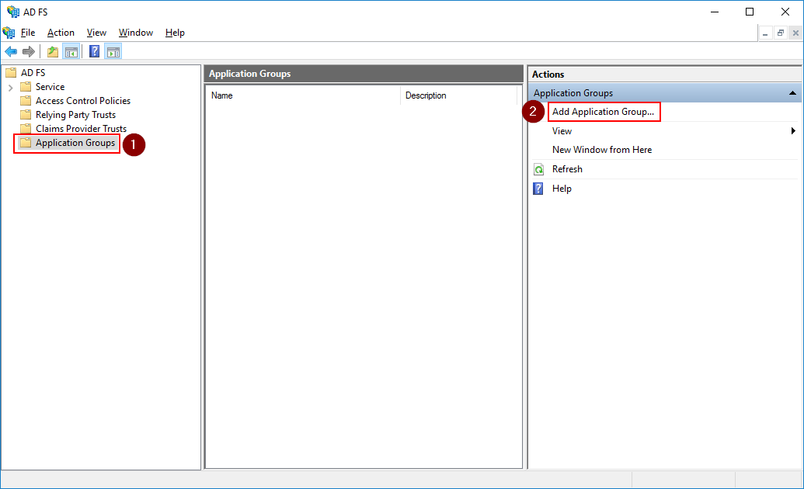
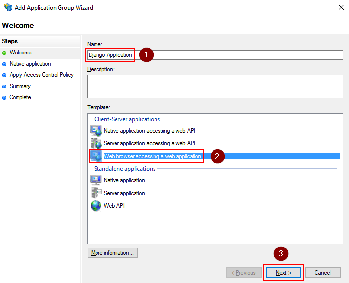
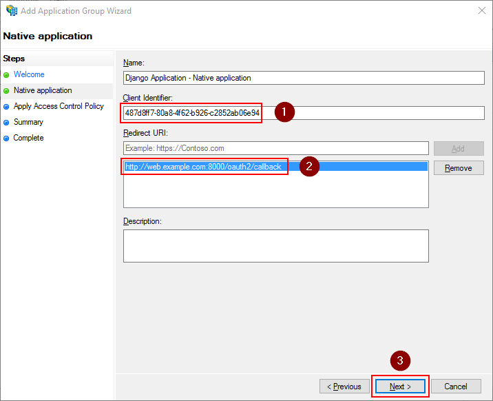
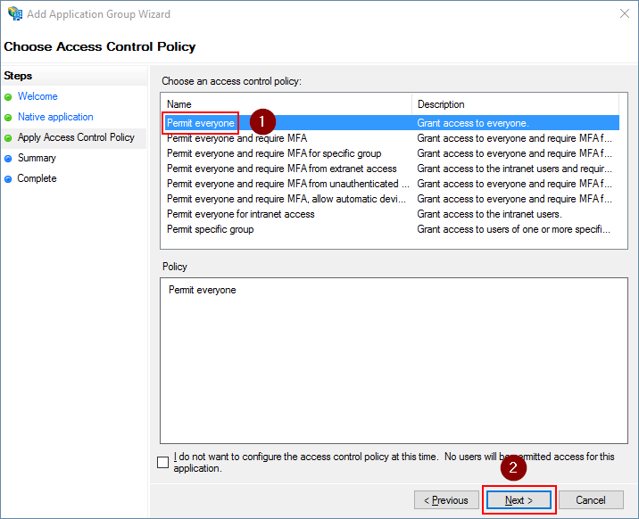
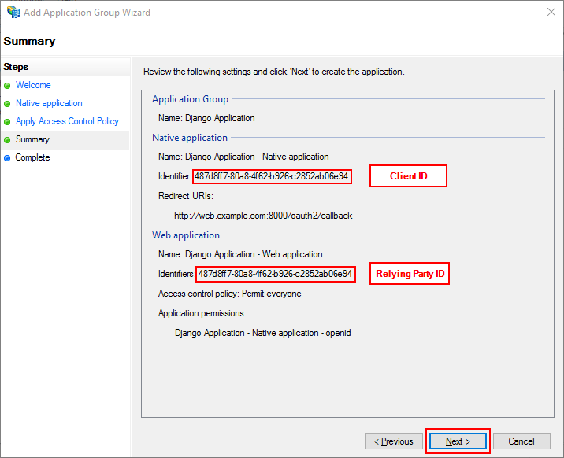
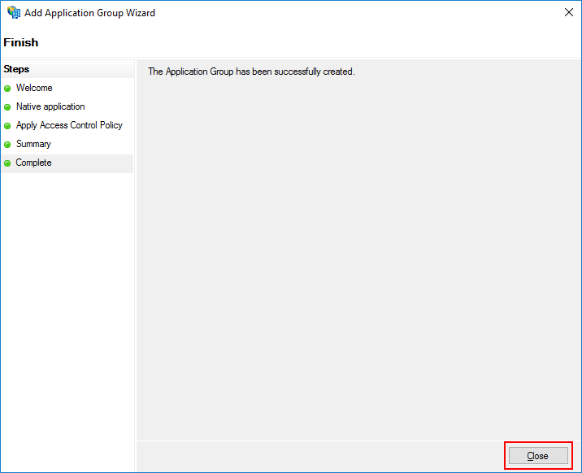
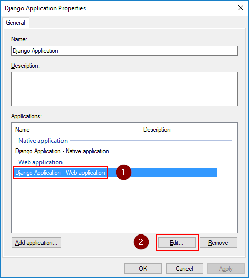
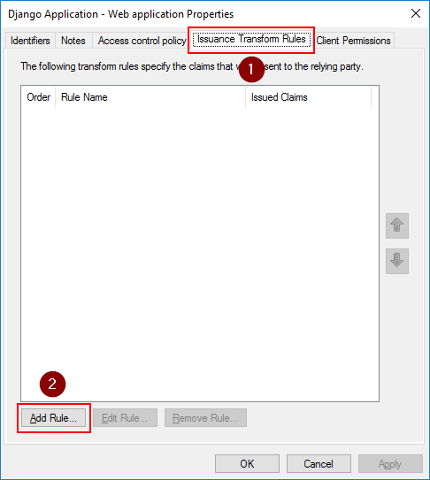
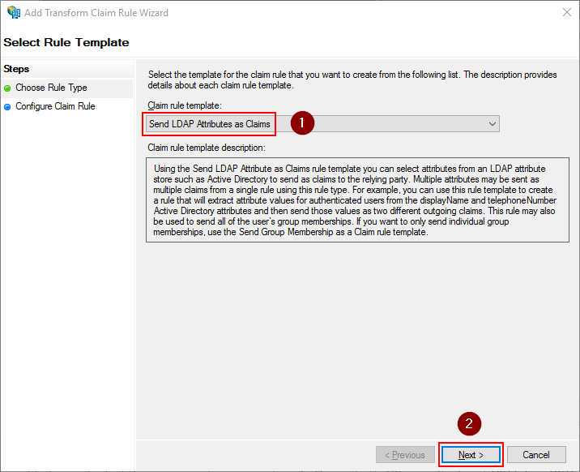
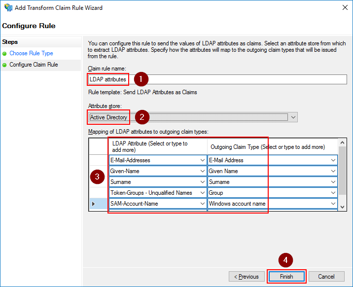

Windows 2016 - ADFS 4.0
=======================

Getting this module to work is sometimes not so straight forward. If your not familiar with JWT tokens or ADFS itself,
it might take some tries to get all settings right.

This guide tries to give a basic overview of how to configure ADFS and how to determine the settings for
django-auth-adfs. Installing and configuring the basics of ADFS is not explained here.

* **ADFS server:** https://adfs.example.com
* **Web server:** http://web.example.com:8000

Step 1 - Configuring an Application Group
-----------------------------------------

From the AD FS Management screen, go to **AD FS ➜ Application Groups** and
click **Add Application Group...**

------------

Fill in a **name** for the application group, select **Web browser accessing a web application** and click **Next**.

------------

Make note of the **Client Identifier** value. This will be the value for the :ref:`client_id_setting` setting.

The **Redirect URI** value must match with the domain where your Django application is located and the patch where you
mapped the ``django_auth_adfs`` urls in your ``urls.py`` file. If you follow the installation steps from this
documentation, this should be something like ``https://your.domain.com/oauth2/callback``.

------------

Select **Permit everyone** and click **Next**.

------------

Review the settings and click **Next**

* The **Client ID** is the value for the :ref:`client_id_setting` setting.
* The **Relying Party ID** is the value for the :ref:`relying_party_id_setting` and :ref:`audience_setting` setting.

While they both are the same in this screenshot, they can be changed independently from one another afterwards.

------------

Close the wizard by clicking **Close**. Our django application is now registered in ADFS.

Step 2 - Configuring Claims
---------------------------

Open the **properties** for the application group we just created.
Select the **Web application** entry and click **Edit**

------------

On the **Issuance Transform Rules** tab, click the **Add Rule** button

------------

Select **Send LDAP Attributes as Claims** and click **Next**

------------

Give the rule a name and select **Active Directory** as the attribute store. Then configure the below claims.

+----------------------------------+----------------------+
| LDAP Attribute                   | Outgoing Claim Type  |
+==================================+======================+
| E-Mail-Addresses                 | E-Mail Address       |
+----------------------------------+----------------------+
| Given-Name                       | Given Name           |
+----------------------------------+----------------------+
| Surname                          | Surname              |
+----------------------------------+----------------------+
| Token-Groups - Unqualified Names | Group                |
+----------------------------------+----------------------+
| SAM-Account-Name                 | Windows Account Name |
+----------------------------------+----------------------+

Click **Finish** to save the settings

.. note::
    The **Outgoing Claim Type** is what will be visible in the JWT Access Token. The first 3 claims will go into the
    :ref:`claim_mapping_setting` setting. The 4th is the :ref:`groups_claim_setting` setting. The 5th is the
    :ref:`username_claim_setting` setting.

    You cannot just copy the outgoing claim type value from this screen and use it in the settings. The name of the
    claim as it is in the JWT token is the short name which you can find in the AD FS Management screen underneath
    **AD FS ➜ Service ➜ Claim Descriptions**

------------

You should now see the rule added. Click **OK** a couple of times to save the settings.

Step 3 - Determine configuration settings
-----------------------------------------

Once everything is configured, you can use the below PowerShell commands to determine the value for the settings of this
package. The ``<<<<<<`` in the output indicate which settings should match this value.

.. code-block:: ps1con

    PS C:\Users\Administrator> Get-AdfsNativeClientApplication

    Name                       : Django Application - Native application
    Identifier                 : 487d8ff7-80a8-4f62-b926-c2852ab06e94      <<< CLIENT_ID <<<
    ApplicationGroupIdentifier : Django Application
    Description                :
    Enabled                    : True
    RedirectUri                : {http://web.example.com:8000/oauth2/callback}
    LogoutUri                  :

    PS C:\Users\Administrator> Get-AdfsProperties | select HostName | Format-List

    HostName : adfs.example.com      <<< SERVER <<<

    PS C:\Users\Administrator> Get-AdfsWebApiApplication | select Identifier | Format-List

    Identifier             : {web.example.com}      <<< RELYING_PARTY_ID and AUDIENCE <<<

If you followed this guide, you should end up with a configuration like this.

.. code-block:: python

    AUTH_ADFS = {
        "SERVER": "adfs.example.com",
        "CLIENT_ID": "487d8ff7-80a8-4f62-b926-c2852ab06e94",
        "RELYING_PARTY_ID": "web.example.com",
        "AUDIENCE": "microsoft:identityserver:web.example.com",
        "CLAIM_MAPPING": {"first_name": "given_name",
                          "last_name": "family_name",
                          "email": "email"},
        "USERNAME_CLAIM": "winaccountname",
        "GROUP_CLAIM": "group"
    }
