ADFS Configuration Guide
========================

Getting this module to work is sometimes not so straight forward. If your not familiar with JWT tokens or ADFS itself,
it might take some tries to get all settings right.

This guide tries to given a very basic overview of how to configure ADFS and how to determine the settings for
django-auth-adfs. Installing and configuring the basics of ADFS is not in scope.

* **ADFS server:** https://adfs.example.com
* **Web server:** http://webserver.example.com

Step 1 - Configuring a Relying Party Trust
------------------------------------------

.. image:: _static/ADFS_step_01.PNG
   :scale: 50 %

From the AD FS Management screen, go to **AD FS ➜ Trust Relationships ➜ Relying Party Trusts** and
click **Add Relying Party Trust...**

.. image:: _static/ADFS_step_02.PNG
   :scale: 50 %

Click **Start**

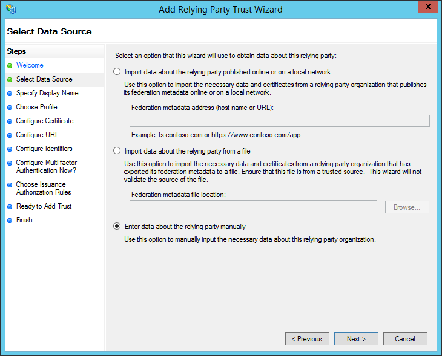

Select **Enter data about the relying party manually** and click **Next**

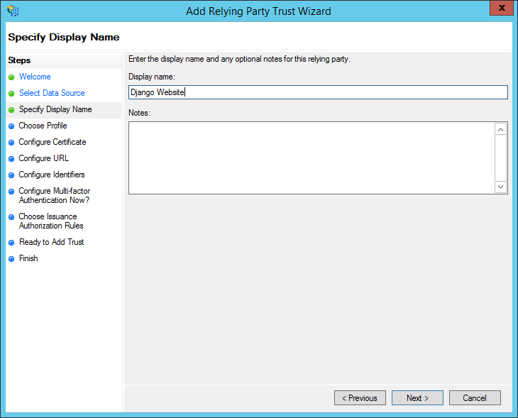

Enter a display name for the relying party and click **Next**.

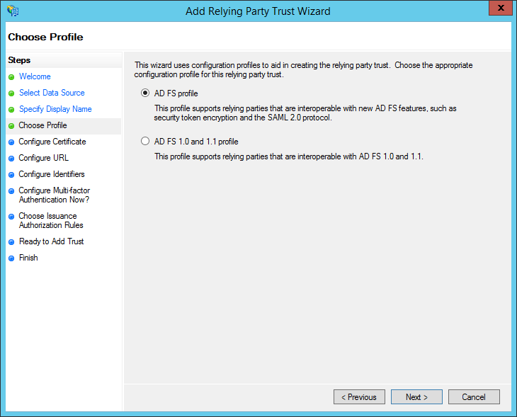

Select **AD FS profile** and click **Next**

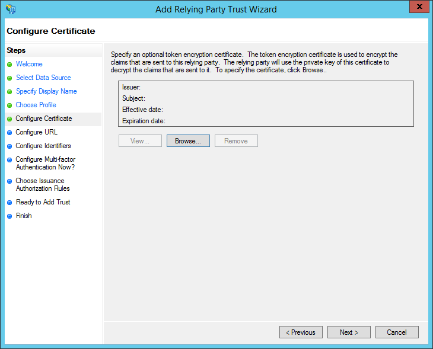

Leave everything empty click **Next**

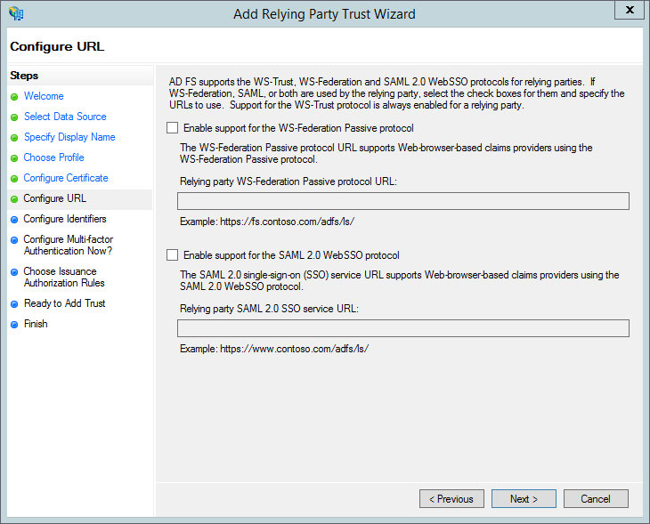

We don't need WS-Federation or SAML support so leave everything empty again and click **Next**

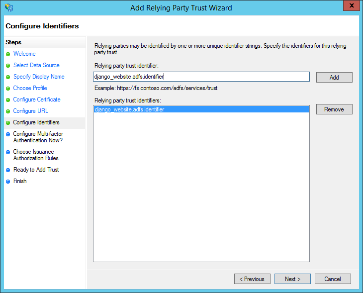

Enter a relying party trust identifier and click **add**. The identifier can be anything but beware, there's a
difference between entering a URL and something else. For more details see the example section of
:ref:`the AUDIENCE setting <audience_setting>`.

.. note::
    This is the value for the :ref:`audience_setting` and the :ref:`resource_setting` settings.

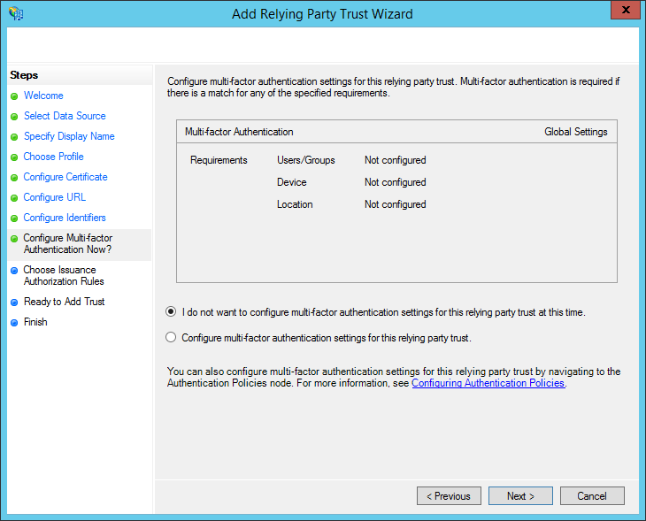

Select **I do not want to configure...** and click **Next**.

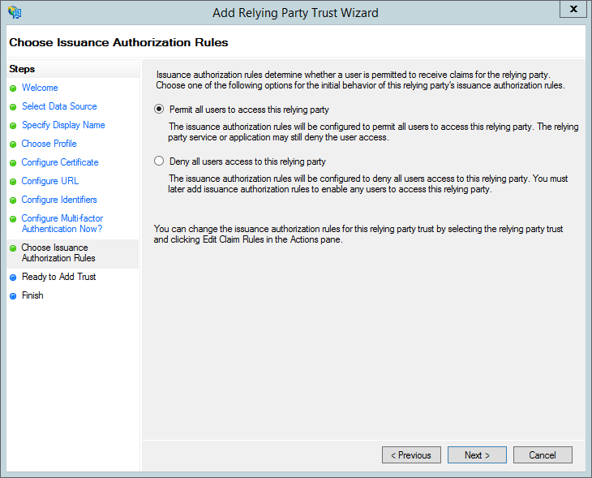

Select `Permit all users to access the relying party` and click **Next**.

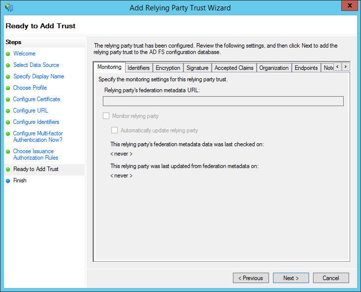

Keep everything default and click **Next**.

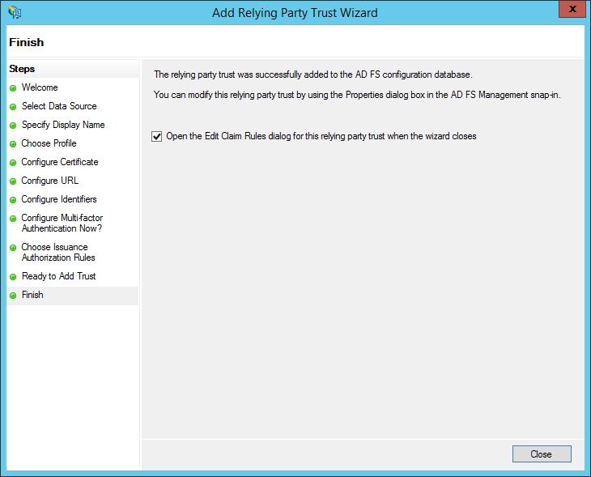

Select **Open the Edit Claim Rules dialog...** and click **Close**

Step 2 - Configuring Claims
---------------------------

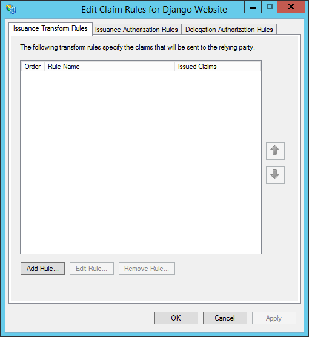

If you selected **Open the Edit Claim Rules dialog...** while adding a relying party, this screen will open
automatically. Else you can open it by right clicking the relying party in the list and select **Edit Claim Rules...**

On the **Issuance Transform Rules** tab, click the **Add Rule** button

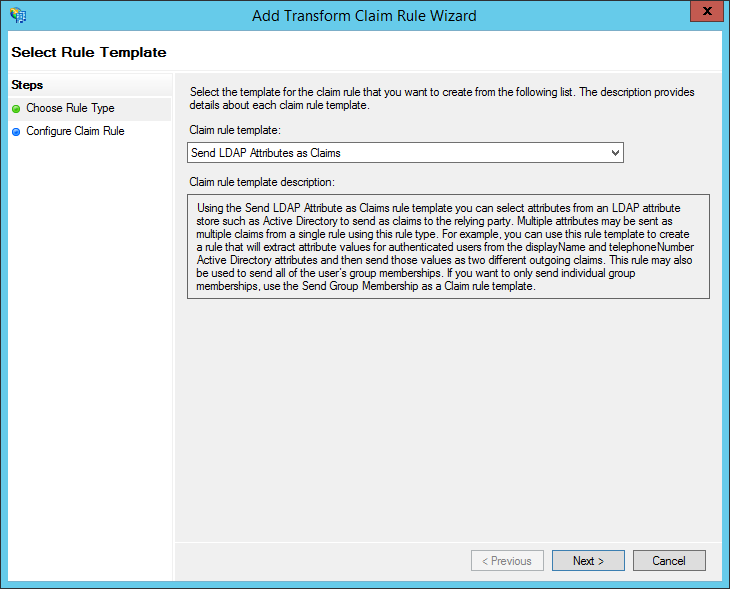

Select **Send LDAP Attributes as Claims** and click **Next**

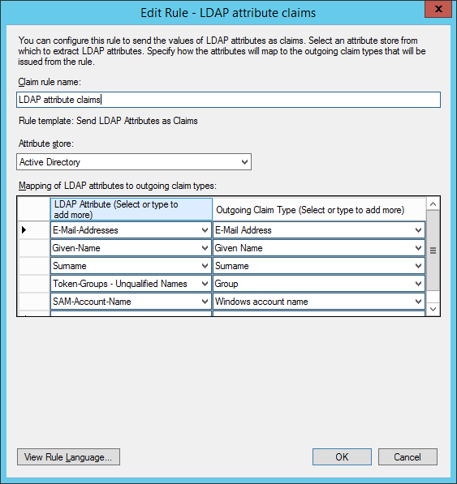

Give the rule a name and select **Active Directory** as the attribute store. Then configure the below claims.

+----------------------------------+----------------------+
| LDAP Attribute                   | Outgoing Claim Type  |
+==================================+======================+
| E-Mail-Addresses                 | E-Mail Address       |
+----------------------------------+----------------------+
| Given-Name                       | Given Name           |
+----------------------------------+----------------------+
| Surname                          | Surname              |
+----------------------------------+----------------------+
| Token-Groups - Unqualified Names | Group                |
+----------------------------------+----------------------+
| SAM-Account-Name                 | Windows Account Name |
+----------------------------------+----------------------+

Click **OK** to save the settings

.. note::
    The **Outgoing Claim Type** is what will be visible in the JWT Access Token. The first 3 claims will go into the
    :ref:`claim_mapping_setting` setting. The 4th is the :ref:`group_claim_setting` setting. The 5th is the
    :ref:`username_claim_setting` setting.

    You cannot just copy the name from this screen. The name of the claim as visible in the JWT token is the
    short name which you can lookup in the AD FS Management screen underneath **AD FS ➜ Service ➜ Claim Descriptions**

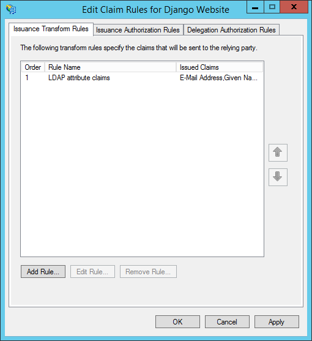

You should now see the rule added. Click **OK** to save the settings.

Step 3 - Add an ADFS client
---------------------------

While the previous steps could be done via the GUI, the next step needs to be performed via PowerShell.

Pick a value for the following fields.

+-------------+-------------------------------------------+
| Name        | Example value                             |
+=============+===========================================+
| Name        | Django Website OAuth2 Client              |
+-------------+-------------------------------------------+
| ClientId    | django_website.adfs.client_id             |
+-------------+-------------------------------------------+
| RedirectUri | http://webserver.example.com/oauth2/login |
+-------------+-------------------------------------------+

Now execute the following command from a powershell console.

.. code-block:: ps1con

    PS C:\Users\Administrator> Add-ADFSClient -Name "Django Website OAuth2 Client" -ClientId "django_website.adfs.client_id" -RedirectUri "http://webserver.example.com/oauth2/login"

The **ClientId** value will be the :ref:`client_id_setting` setting and the **RedirectUri** value will be
the :ref:`redir_uri_setting` setting.

Step 4 - Determine configuration settings
-----------------------------------------

Once everything is configured, you can use the below PowerShell commands to determine the value for the settings of this
package. The ``## ... ##`` pieces were added to indicate with what setting the value corresponds with.

.. code-block:: ps1con

    PS C:\Users\Administrator> Get-AdfsClient -Name "Django Website OAuth2 Client" | Select RedirectUri,ClientId | Format-List

    ## REDIR_URI ##
    RedirectUri : {http://webserver.example.com/oauth2/login}

    ## CLIENT_ID ##
    ClientId    : django_website.adfs.client_id

    PS C:\Users\Administrator> Get-AdfsProperties | select Hostname,Identifier | Format-List

    ## SERVER ##
    HostName   : adfs.example.com

    ## ISSUER ##
    Identifier : http://adfs.example.com/adfs/services/trust

    PS C:\Users\Administrator> Get-AdfsRelyingPartyTrust -Name "Django Website" | Select Identifier,IssuanceTransformRules | Format-List

    ## RESOURCE ##
    ## AUDIENCE ##
    Identifier             : {django_website.adfs.identifier}

    ## CLAIM_MAPPING ##
    ## GROUP_CLAIM ##
    ## USERNAME_CLAIM ##
    IssuanceTransformRules : @RuleTemplate = "LdapClaims"
                             @RuleName = "LDAP attribute claims"
                             c:[Type == "http://schemas.microsoft.com/ws/2008/06/identity/claims/windowsaccountname",
                             Issuer == "AD AUTHORITY"]
                              => issue(store = "Active Directory", types =
                             ("http://schemas.xmlsoap.org/ws/2005/05/identity/claims/emailaddress",
                             "http://schemas.xmlsoap.org/ws/2005/05/identity/claims/givenname",
                             "http://schemas.xmlsoap.org/ws/2005/05/identity/claims/surname",
                             "http://schemas.xmlsoap.org/claims/Group",
                             "http://schemas.microsoft.com/ws/2008/06/identity/claims/windowsaccountname"), query =
                             ";mail,givenName,sn,tokenGroups,sAMAccountName;{0}", param = c.Value);

If you followed this guide, you should end up with a configuration like this.

.. code-block:: python

    AUTH_ADFS = {
        "SERVER": "adfs.example.com",
        "CLIENT_ID": "django_website.adfs.client_id",
        "RESOURCE": "django_website.adfs.identifier",
        "AUDIENCE": "microsoft:identityserver:django_website.adfs.identifier",
        "ISSUER": "http://adfs.example.com/adfs/services/trust",
        "CA_BUNDLE": False,
        "CLAIM_MAPPING": {"first_name": "given_name",
                          "last_name": "family_name",
                          "email": "email"},
        "USERNAME_CLAIM": "winaccountname",
        "GROUP_CLAIM": "group"
        "REDIR_URI": "http://webserver.example.com/oauth2/login",
    }
