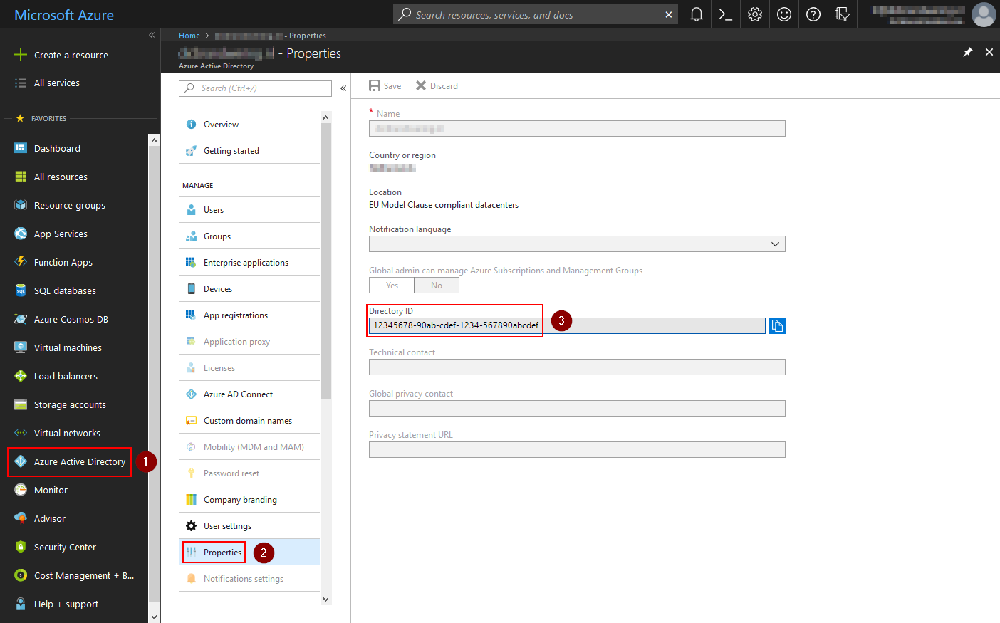
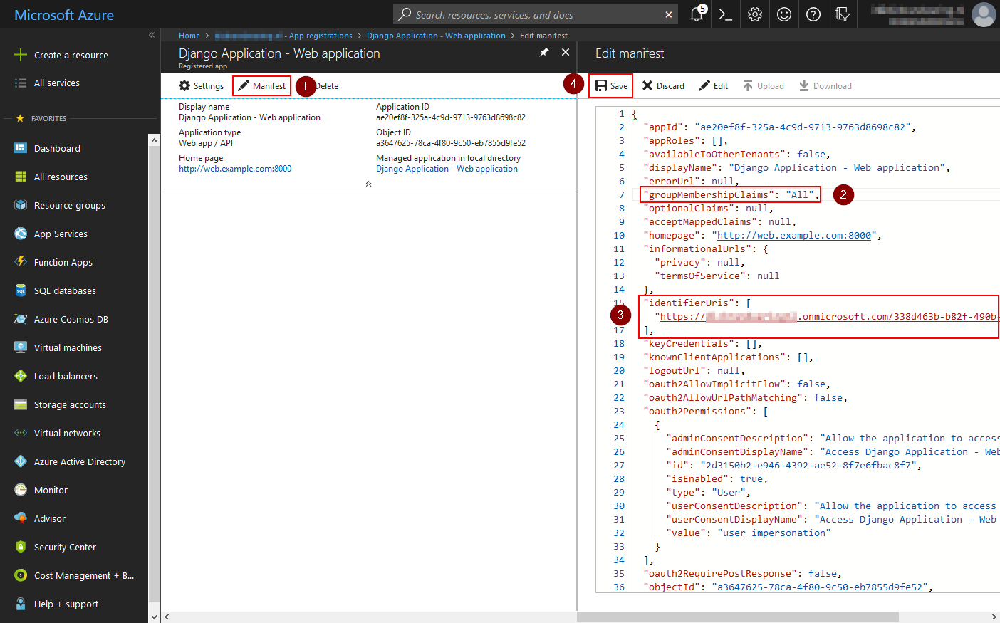
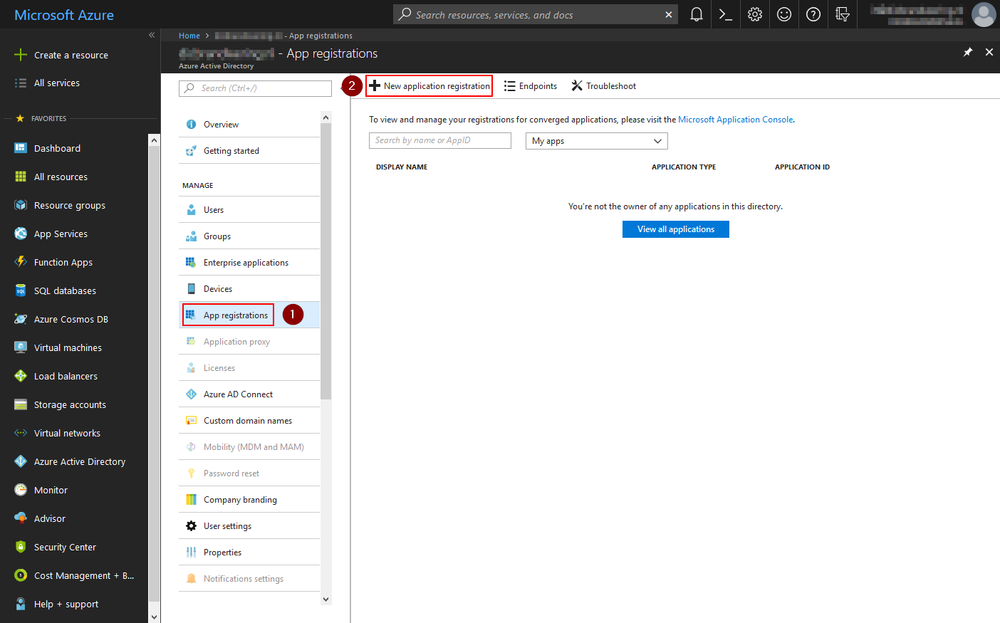
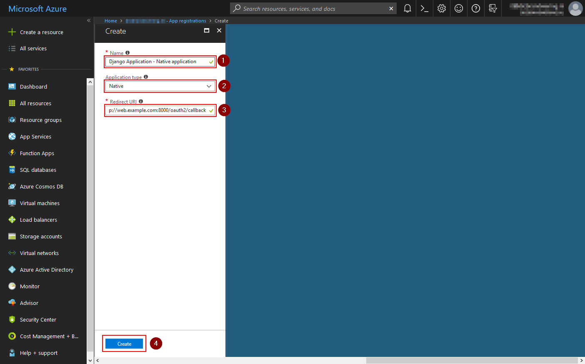
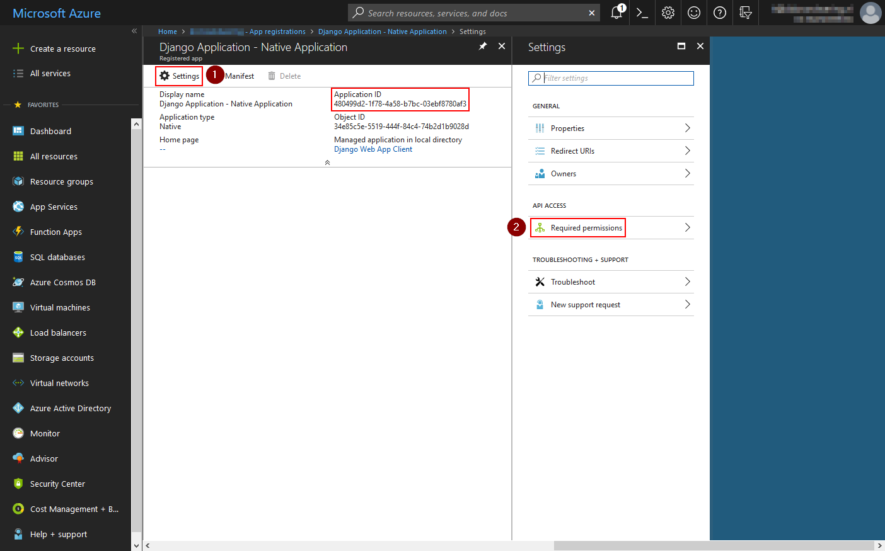
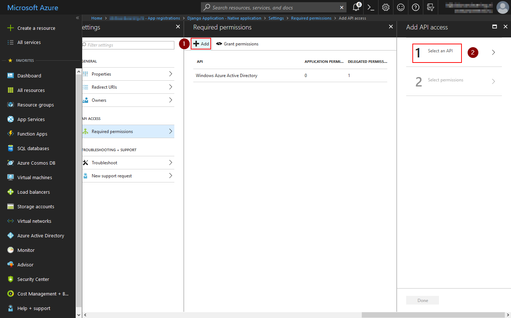
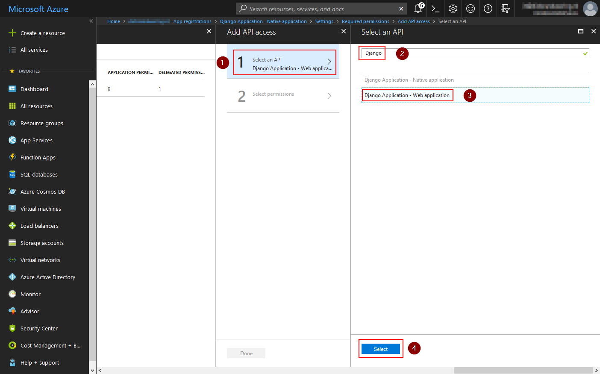
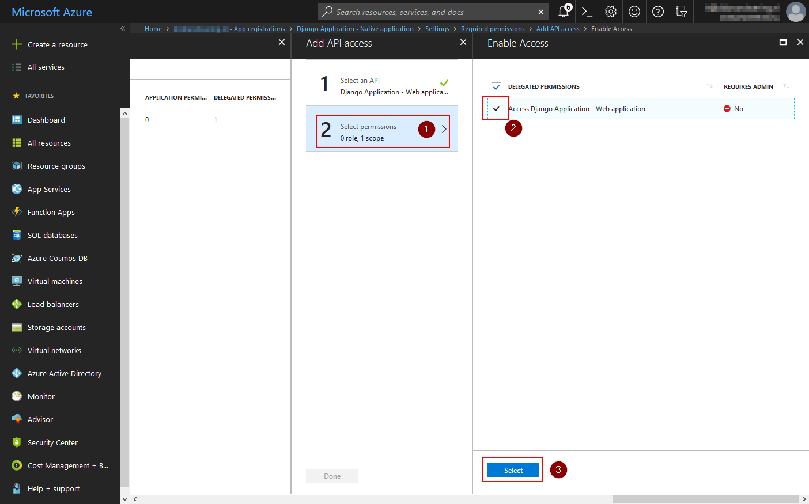
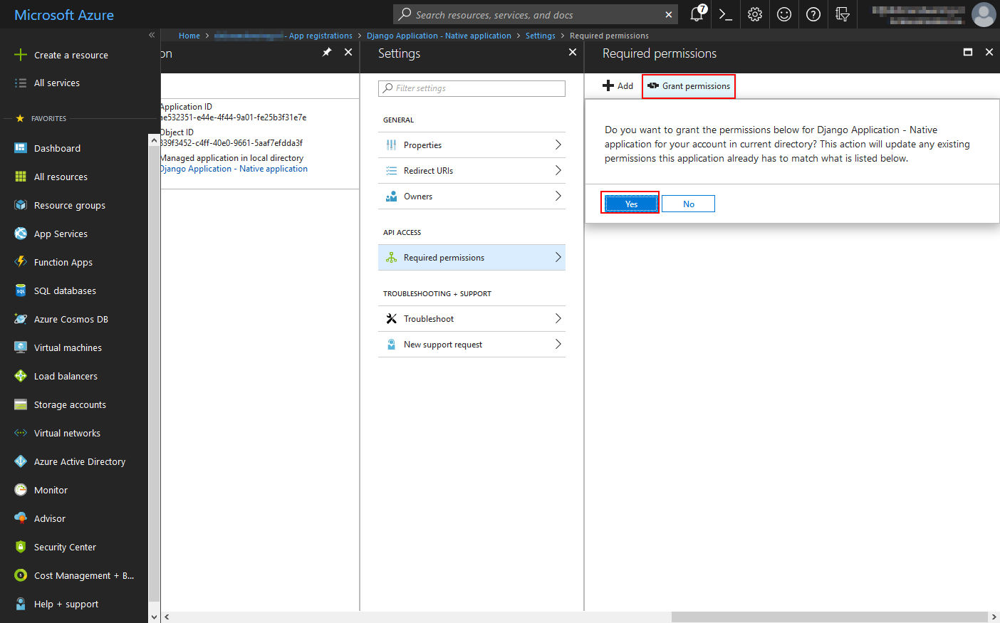

Azure AD
========

Getting this module to work is sometimes not so straight forward. If your not familiar with JWT tokens or Azure AD
itself, it might take some tries to get all settings right.

This guide tries to give a basic overview of how to configure Azure AD and how to determine the settings for
django-auth-adfs. Installing and configuring the basics of Azure AD is not explained here.

* **Web server:** http://webserver.example.com

Step 1 - Register an application
--------------------------------

Open the **Azure Active Directory** dashboard and click **Properties**.
The **Directory ID** field contains the value for the :ref:`tenant_id_setting` setting.

------------

Click **App registrations** and then **New application registration**.

.. image:: _static/AzureAD/02-add_web_application.png
   :scale: 50 %

------------

Enter a name for the application, select **Web app / API** as type and fill in the URL of the main page of your website.

------------

Click the **Manifest** button.

* Change the value of ``groupMembershipClaims`` to ``"All"`` to add the claim with groups to the access token.
* The value of ``identifierUris`` is the value for the :ref:`relying_party_id_setting` and
  :ref:`audience_setting` setting.

Click the **Save** button to save the settings.

------------

Use the breadcrumbs at the top to navigate back to **App registration** and click the **New application registration**
button again.

------------

Fill in a name again an this time select the **Native** type.

The **Redirect URI** value must match with the domain where your Django application is located and the patch where you
mapped the ``django_auth_adfs`` urls in your ``urls.py`` file. If you follow the installation steps from this
documentation, this should be something like ``https://your.domain.com/oauth2/callback``.

------------

The value of ``Application ID`` is the value for the :ref:`client_id_setting` setting.

The native application now needs to be given permission to access the web application we created earlier.
Click the **Settings** button and then select **Required permissions**

------------

Click **Add** and then **Select API**

------------

Search for your web application (it won't show by default), select it from the list and click the **Select** button.

------------

Click **Select Permissions**, check the checkbox in front of the web application and click the **Select** button.

------------

As a final step, click the **Grant permissions** button and confirm with **Yes**.

Step 2 - Configuring Claims
---------------------------

Except for the groups claim we configure earlier, there isn't much we can configure on Azure AD.

The :ref:`claim_mapping_setting`, :ref:`groups_claim_setting` and :ref:`username_claim_setting` settings are all
automatically set when you configure the :ref:`tenant_id_setting` setting.

It boils down to these settings:

.. code-block:: python

    USERNAME_CLAIM = "upn"
    GROUPS_CLAIM = "groups"
    CLAIM_MAPPING = {"first_name": "given_name",
                     "last_name": "family_name",
                     "email": "email"}

Step 3 - Determine configuration settings
-----------------------------------------

A quick recap of which Azure AD values relate to which settings.

+---------------------------------------+-------------------------------+
| LDAP Attribute                        | Outgoing Claim Type           |
+=======================================+===============================+
| Directory ID                          | TENANT_ID                     |
+---------------------------------------+-------------------------------+
| Native app's Application ID           | CLIENT_ID                     |
+---------------------------------------+-------------------------------+
| Web app / API it's ``identifierUris`` | RELYING_PARTY_ID and AUDIENCE |
+---------------------------------------+-------------------------------+

If you followed this guide, you should end up with a configuration like this.

.. code-block:: python

    AUTH_ADFS = {
        "TENANT_ID": "12345678-90ab-cdef-1234-567890abcdef",
        "CLIENT_ID": "480499d2-1f78-4a58-b7bc-03ebf8780af3",
        "RELYING_PARTY_ID": "https://examplecom.onmicrosoft.com/338d463b-b82f-490b-567890abcdef",
        "AUDIENCE": "https://examplecom.onmicrosoft.com/338d463b-b82f-490b-567890abcdef",
    }
