Azure AD
========

Getting this module to work is sometimes not so straightforward. If you're not familiar with JWT tokens or Azure AD
itself, it might take some tries to get all the settings right.

This guide tries to give a basic overview of how to configure Azure AD and how to determine the settings for
django-auth-adfs. Installing and configuring the basics of Azure AD is not explained here.

Step 1 - Register a backend application
---------------------------------------

After signing in to `Azure <https://portal.azure.com>`_. Open the **Azure Active Directory** dashboard. 

.. image:: _static/AzureAD/01-azure_active_directory.png
   :scale: 50 %

------------

Note down your **Tenant_ID** as you will need it later.

.. image:: _static/AzureAD/02-azure_dashboard.png
    :scale: 50 %

------------

Navigate to **App Registrations**, then click **New registration** in the upper left hand corner.

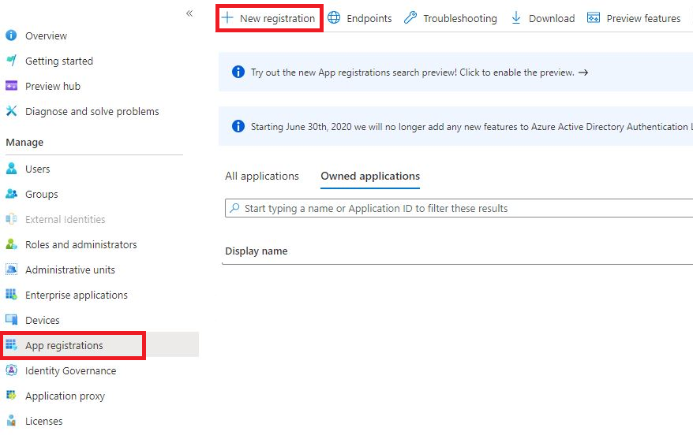

------------

Here you register your application. 

1. The display name of your application. 
2. What type of accounts can access your application.
3. Here you need to add allowed redirect URIs. The Redirect URI value must match with the domain where your Django application is located(*eg. http://localhost:8000/oauth2/callback*).

.. image:: _static/AzureAD/04-app_registrations_specs.png
    :scale: 50 %

------------

When done registering, you will be redirected to your applications overview. Here you need to note down your **Client_ID**. This is how your Django project finds the right Azure application.  

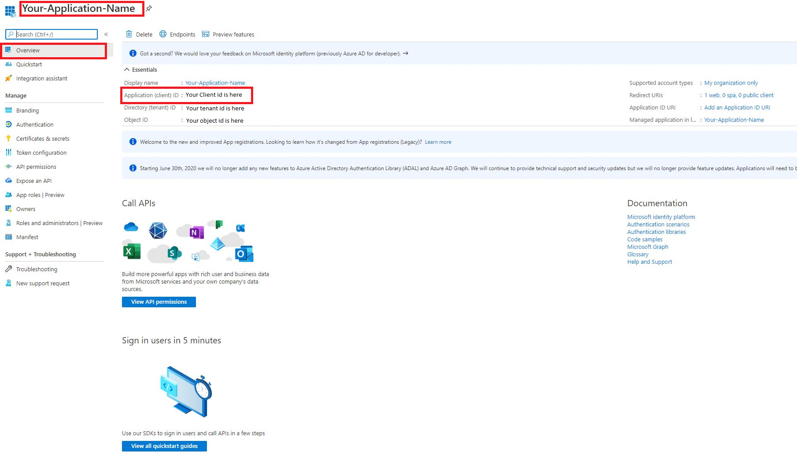

------------

Next we need to generate a **Client_Secret**. Your application will use this to prove its identity when requesting a token. 

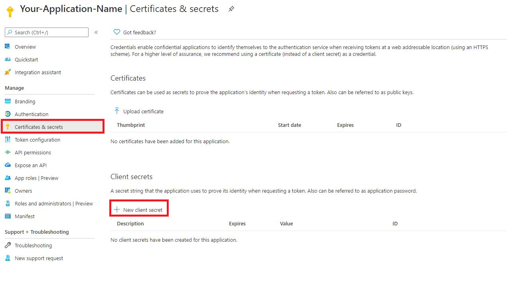

------------

Give it a short (display) name. This is only used by you, to help keep track of in case you make more client secrets.

.. image:: _static/AzureAD/07-add_Secret_name.png
    :scale: 50 %

------------

Copy your secret (value). It will be become hidden after a short time, so be sure to note this quickly.

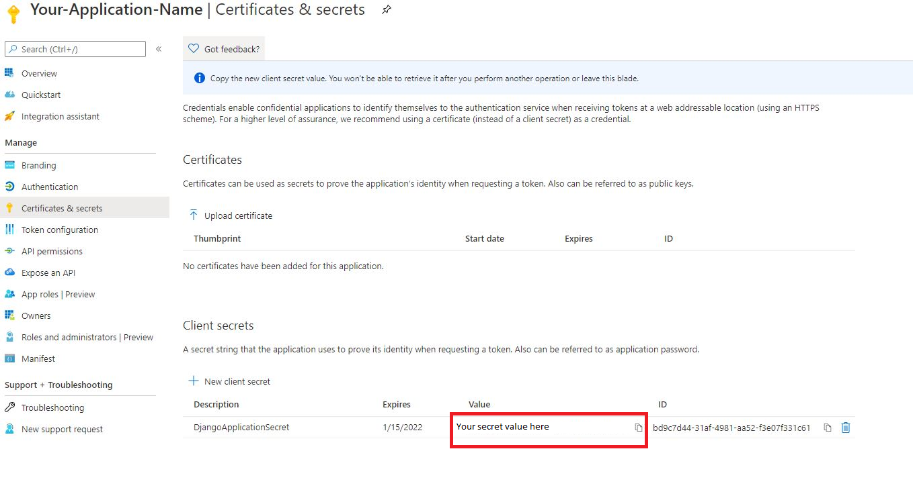

------------

    
Step 2 - Configuring settings.py
--------------------------------
We need to update the ``settings.py`` to accommodate our registered Azure AD application. 

Replace your AUTH_ADFS with this.

.. code-block:: python

    # Client secret is not public information. Should store it as an environment variable.
    
    client_id = 'Your client id here'
    client_secret = 'Your client secret here'
    tenant_id = 'Your tenant id here'
    

    AUTH_ADFS = {
        'AUDIENCE': client_id,
        'CLIENT_ID': client_id,
        'CLIENT_SECRET': client_secret,
        'CLAIM_MAPPING': {'first_name': 'given_name',
                          'last_name': 'family_name',
                          'email': 'upn'},
        'GROUPS_CLAIM': 'roles',
        'MIRROR_GROUPS': True,
        'USERNAME_CLAIM': 'upn',
        'TENANT_ID': tenant_id,
        'RELYING_PARTY_ID': client_id,
    }
    

Add this to your AUTHENTICATION_BACKENDS.

.. code-block:: python

    AUTHENTICATION_BACKENDS = [
        ...
        'django_auth_adfs.backend.AdfsAccessTokenBackend',
        ...
    ]

Add this path to your project's ``urls.py`` file.

.. code-block:: python

    urlpatterns = [
        ...
        path('oauth2/', include('django_auth_adfs.urls')),
        ...
    ] 
    
Step 3 - Register and configure an Azure AD frontend application
----------------------------------------------------------------
Just like we did with our backend application in step 1, we have to register a new app for our frontend. In this example we are authenticating a Django Rest Framework token through a single page application(SPA). The redirect URI value must match with the domain where your frontend application is located(eg. http://localhost:3000).

.. image:: _static/AzureAD/09_register_frontend_app.PNG
    :scale: 50 %

------------

Copy your frontend's client ID, you will need later

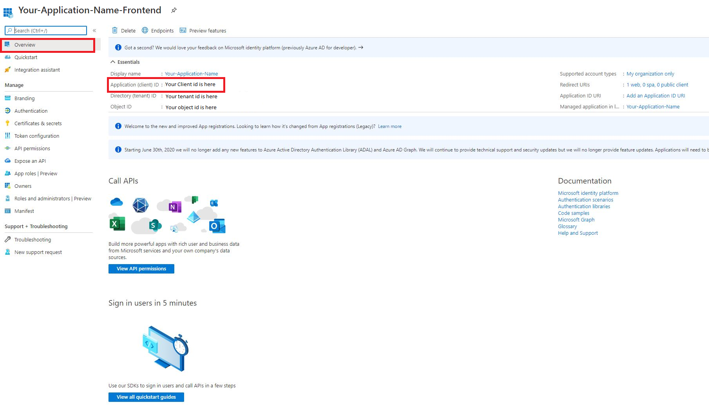

------------

Now we need to add a scope of permissions to our API. 
Navigate back to app registrations and click on your backend application.
Go to **Expose an API** in the sidebar and press **add a scope**.

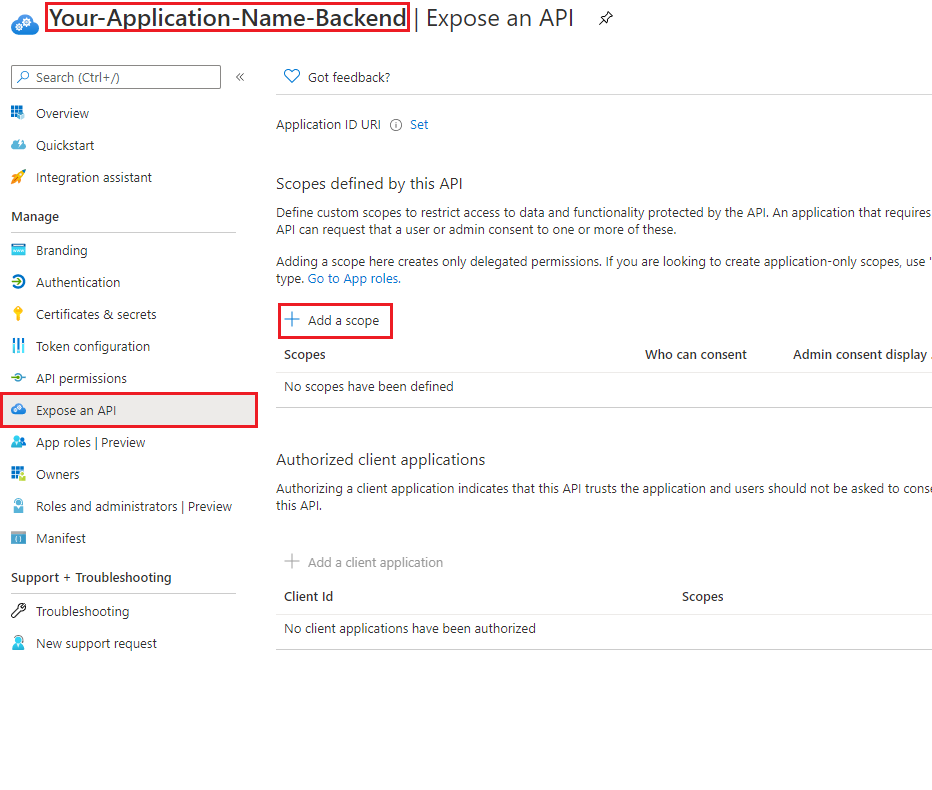

------------

If you have not created an Application ID URI, it will be autogenerated for you. Select it and press **save and continue**.

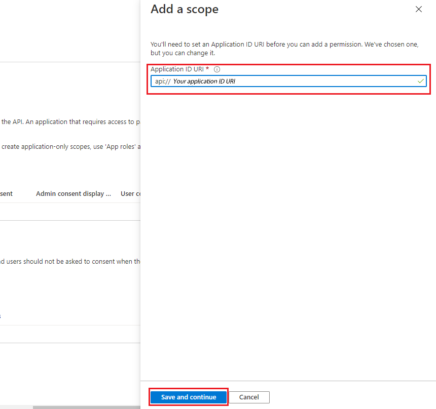

------------

Then we will create the actual scope. Call it "read", and just fill in all the required fields with "read" (maybe write an actual description).

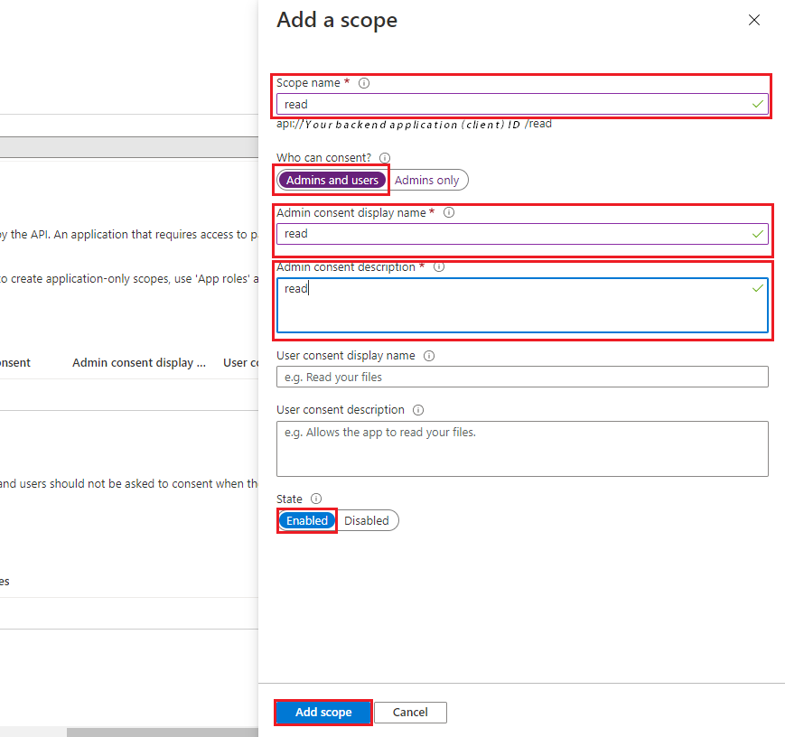

------------

Now we are going to add our frontend application as a trusted app for our backend. Press **add a client application**

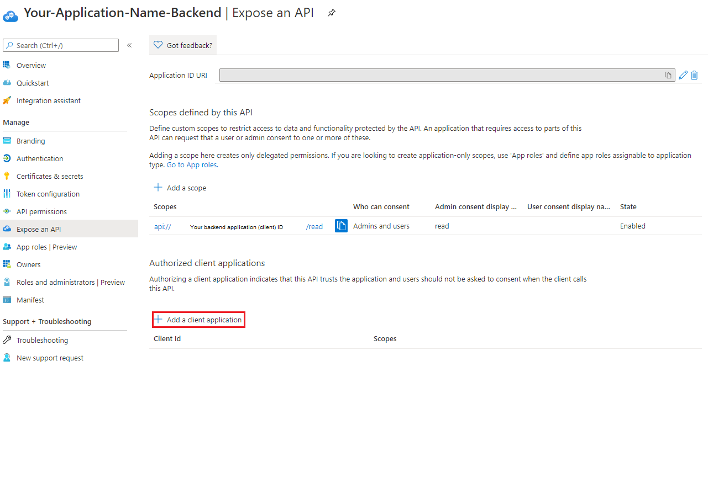

------------

Here you need to paste in your frontend application (client) id.

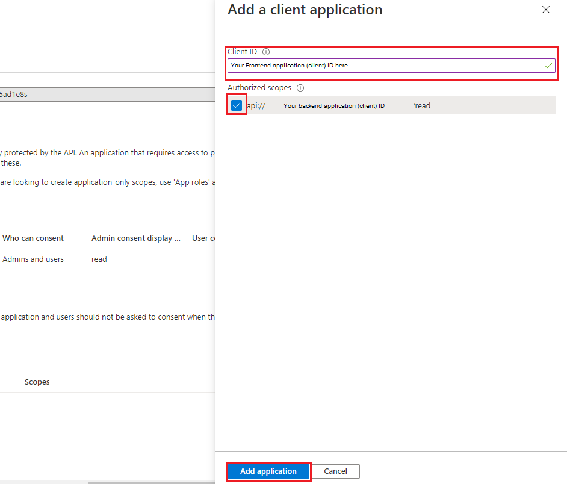

------------

Now navigate back to app registrations. Click on your **frontend** application and navigate to API permissions. Press **add a permission**.

.. image:: _static/AzureAD/17_navigate_to_api_permissions.PNG
    :scale: 50 %

------------

Then we have to press **My API's** and then select the backend application. (This could be different if you don't have owner rights of the backend application.)

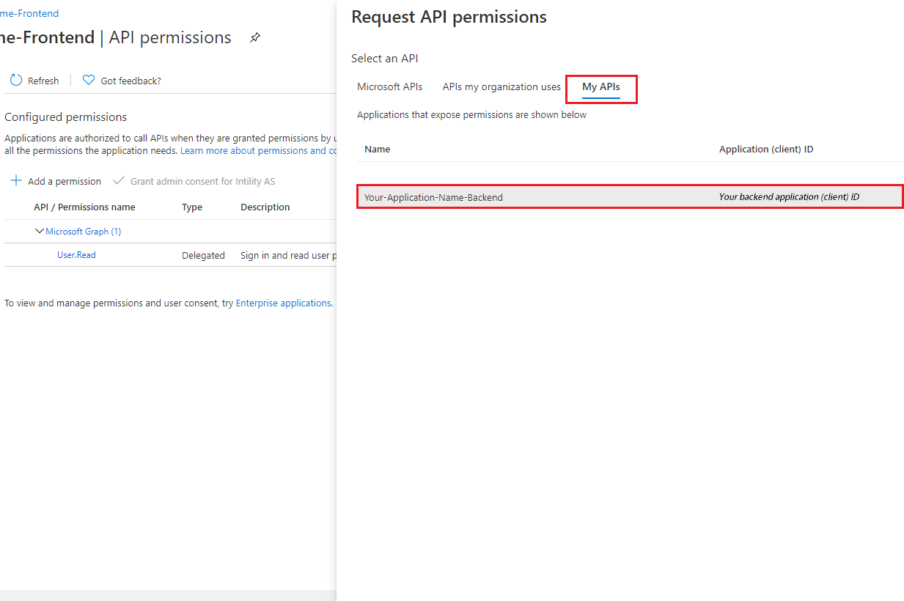

------------

Here we can give our frontend the permission scope we created earlier. Press **Delegated permissions** (should be default) and select the permission you created and press **add permission**

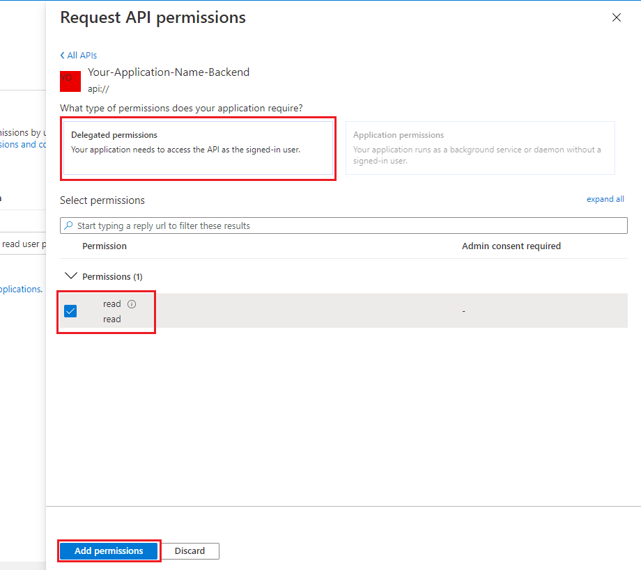

------------

Finally, sometimes the plugin will need to obtain the user groups claim from MS Graph (for example when the user has too many groups to fit in the access token), to ensure the plugin can do this successfully add the GroupMember.Read.All permission.

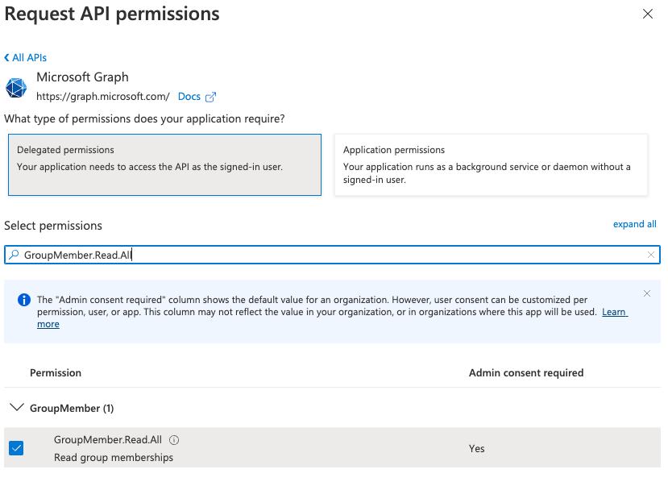
