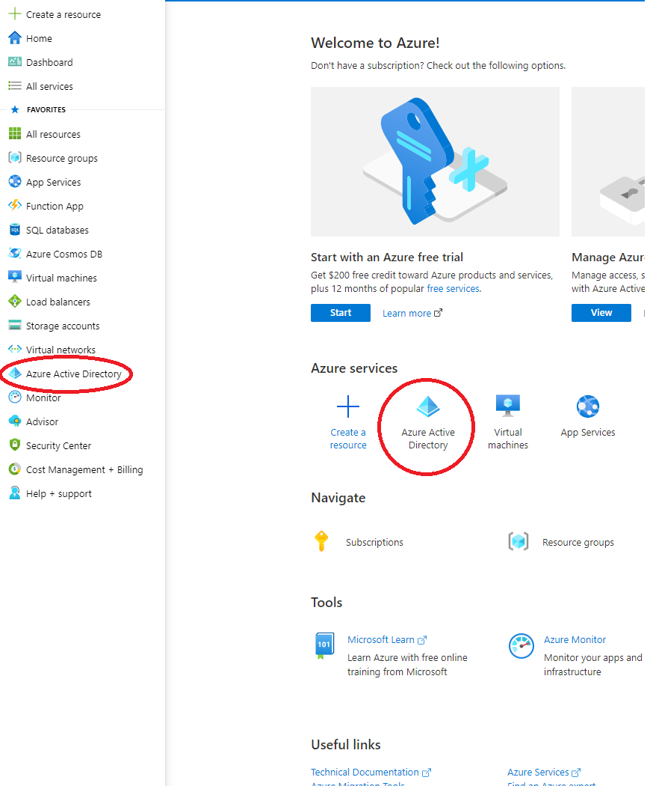
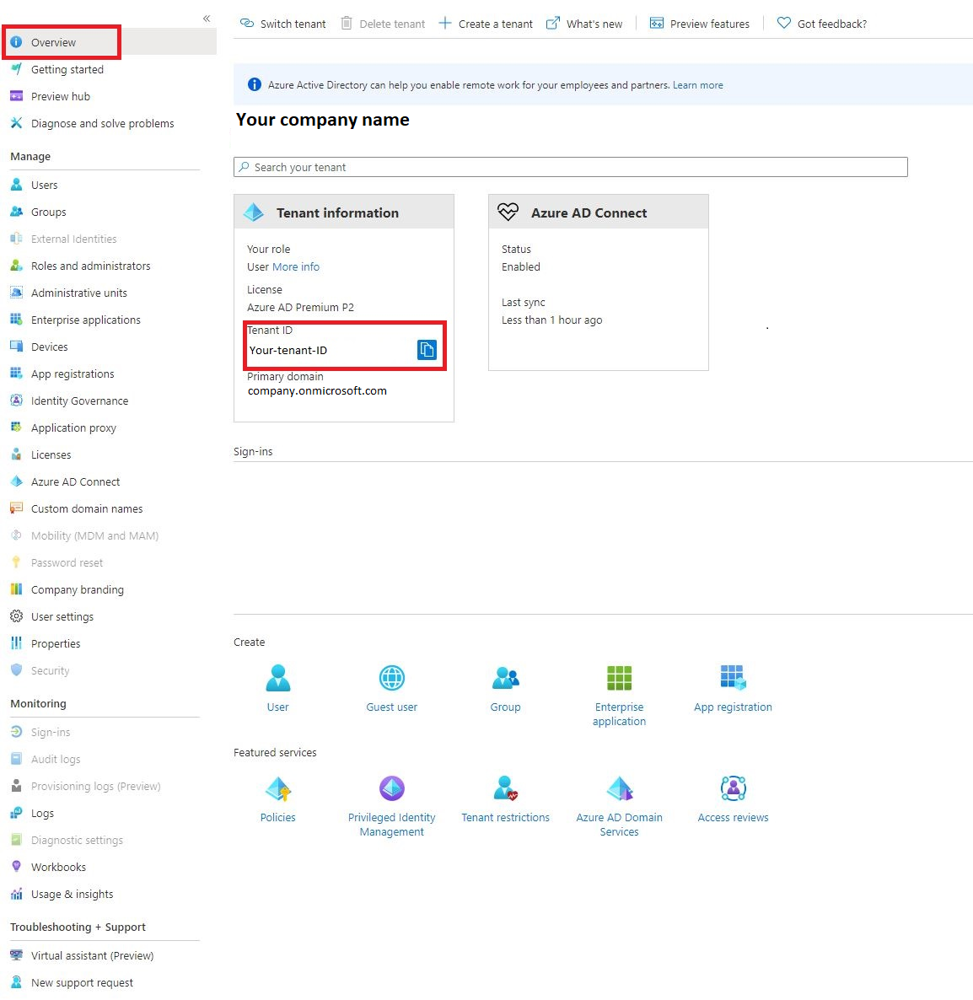
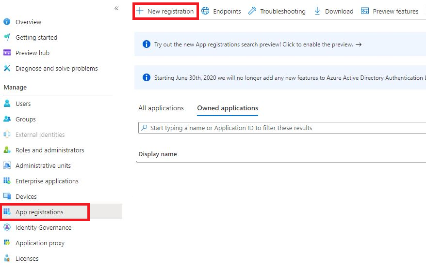
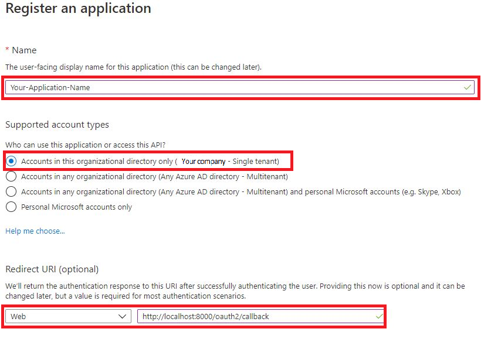
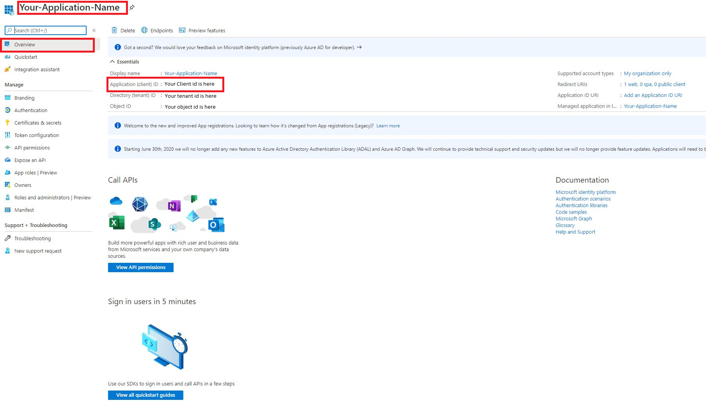
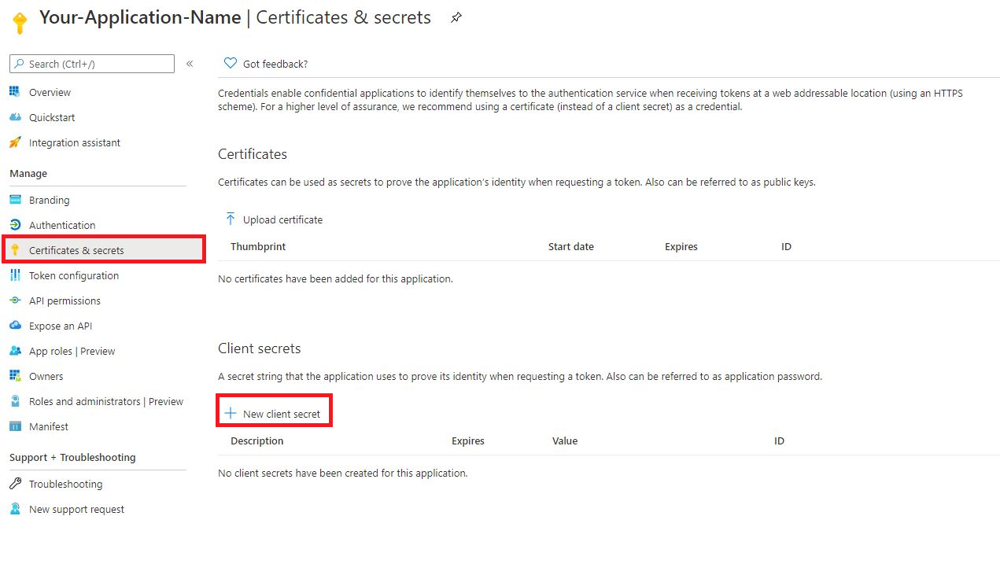
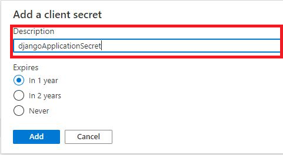
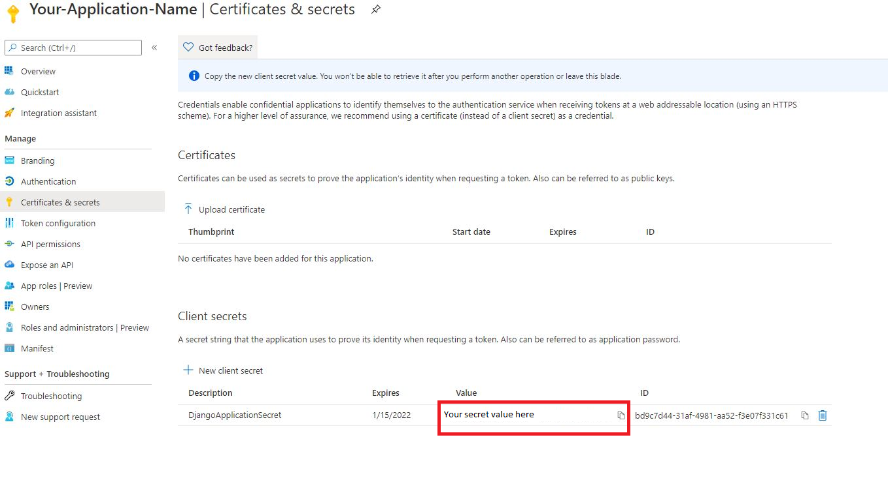

Azure AD
========

Getting this module to work is sometimes not so straight forward. If your not familiar with JWT tokens or Azure AD
itself, it might take some tries to get all settings right.

This guide tries to give a basic overview of how to configure Azure AD and how to determine the settings for
django-auth-adfs. Installing and configuring the basics of Azure AD is not explained here.

Step 1 - Register an application
--------------------------------

After signing in to `Azure <https://portal.azure.com>`_. Open the **Azure Active Directory** dashboard. 

------------

Note down your **Tenant_ID** you will need it later.

------------

Navigate to **App Registrations**, then click **New registration** in the upper left hand corner.

------------

Here you register your application. 

1. The display name of your application. 
2. What type of accounts can access your application.
3. Here you need to add allowed redirect URIs. The Redirect URI value must match with the domain where your Django application is located(*eg. http://localhost:8000/oauth2/callback*).

------------

When done registering, you will be redirected to your applications overview. Here you need to note down your **Client_ID**. This is how your Django project finds the right Azure application.  

------------

Next we need to generate a **Client_Secret**. Your application will use this to prove its identity when requesting a token. 

------------

Give it a short name. It is not important what it is, only used by you, to better keep track of them incase you make more.

------------

It will be become hidden after a short time, so be sure to note this one down quick.

------------

    
Step 2 - Configuring settings.py
--------------------------------------------------------
We need to update the ``settings.py`` to accomedate for our registered Azure AD application. 

Replace your AUTH_ADFS with this.

.. code-block:: python

    # Client secret is not public information. Should store it as an environment variable.
    
    client_id = 'Your client id here'
    cient_secret = 'Your client secret here'
    tenant_id = 'Your tenant id here'
    

    AUTH_ADFS = {
        'AUDIENCE': client_id,
        'CLIENT_ID': client_id,
        'CLIENT_SECRET': cient_secret,
        'CLAIM_MAPPING': {'first_name': 'given_name',
                          'last_name': 'family_name',
                          'email': 'upn'},
        'GROUPS_CLAIM': 'roles',
        'MIRROR_GROUPS': True,
        'USERNAME_CLAIM': 'upn',
        'TENANT_ID': tenant_id,
        'RELYING_PARTY_ID': client_id,
    }
    

Add this to your AUTHENTICATION_BACKENDS.

.. code-block:: python

    AUTHENTICATION_BACKENDS = [
        ...
        'django_auth_adfs.backend.AdfsAccessTokenBackend',
        ...
    ]

Add this path to your projects ``urls.py`` file.

.. code-block:: python

    urlpatterns = [
        ...
        path('oauth2/', include('django_auth_adfs.drf-urls')),
        ...
    ] 
